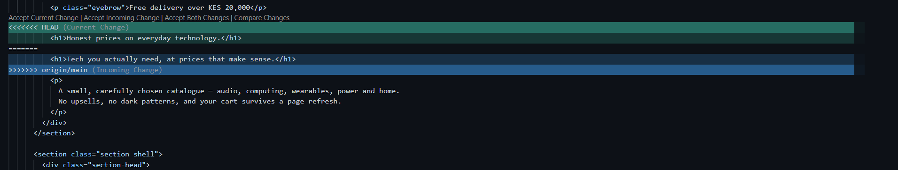
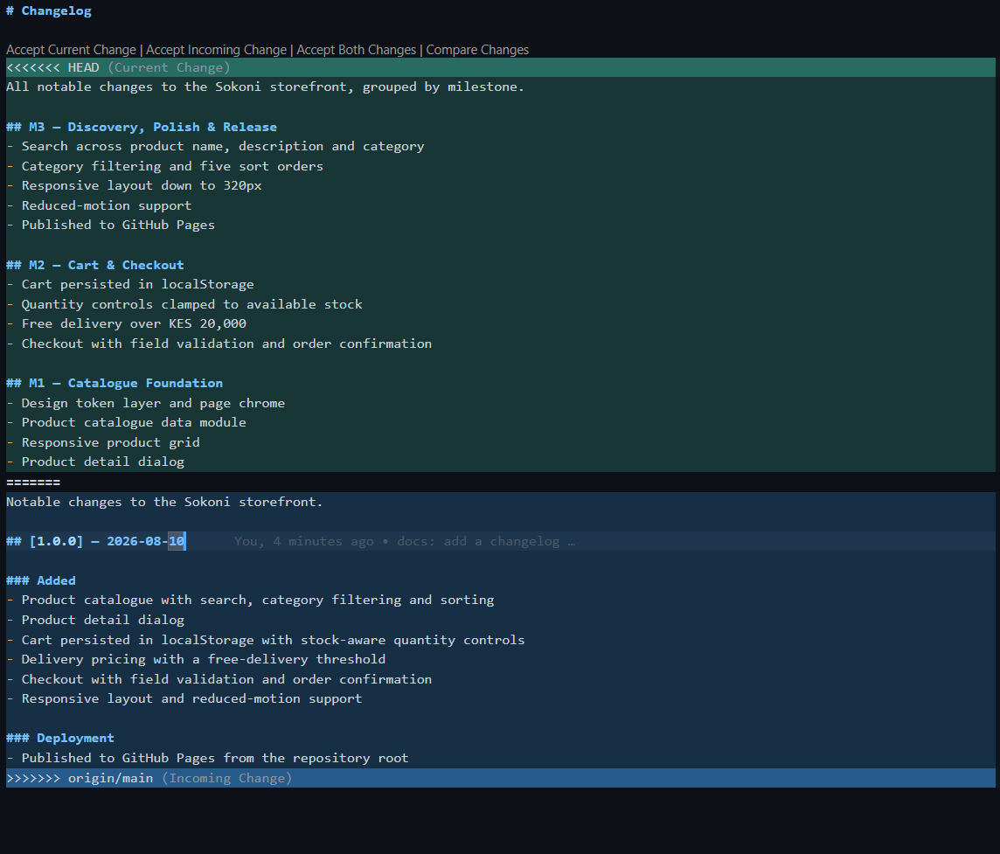
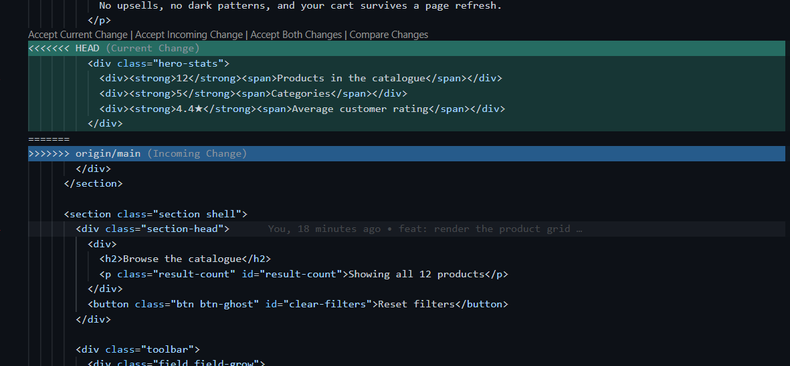

# Project Submission Report

## 1. Student Details

- **Full Name:** Sharon Mugure Kariuki
- **GitHub Username:** [SharonKariuki](https://github.com/SharonKariuki)
- **Email:** sharon.kariuki@strathmore.edu
- **Admission Number:** 169276
- **Class Group:** ICS 4D

---

## 2. Deployed Project Link

- **Live GitHub Pages URL:** https://is-project-2026.github.io/sokoni-storefront-169276/
- **Repository:** https://github.com/IS-PROJECT-2026/sokoni-storefront-169276

---

## 3. Reflection — Grounded in Your Git History

### A. Your Best Commit

- **Commit URL:** https://github.com/IS-PROJECT-2026/sokoni-storefront-169276/commit/135ae2264883123b0777d34015311e1448cc8bbd

- **Why this one?** The subject `refactor: extract delivery pricing into one module` is 44 characters, imperative, and uses the type that actually describes the change — nothing about the site's behaviour changed, so `feat` would have been wrong. The body explains *why* rather than restating the diff: two copies of the delivery rule meant the total could differ between the cart and the checkout, which a shopper reads as a bug even though each screen is internally consistent.

### B. A Mistake or Struggle

- **Link to the evidence:** https://github.com/IS-PROJECT-2026/sokoni-storefront-169276/commit/fa0c85c443c214c08b0b3268b12f475378ed5380

- **What happened and how did you recover?** In that commit I declared `FREE_DELIVERY_FROM` and `DELIVERY_FEE` inside `checkout.js`, having already declared the identical constants in `cart.js` on an earlier branch. Two copies of a pricing rule is a bug waiting to happen: change one and the cart quotes a different total to the checkout. I caught it while re-reading my own diff before merging [PR #18](https://github.com/IS-PROJECT-2026/sokoni-storefront-169276/pull/18), and fixed it in the same pull request with a second commit that extracted `pricing.js` and had both pages call `deliveryFor()`. I kept the two commits separate rather than amending, so the history shows the duplication being introduced and then removed instead of hiding it.

A second, more serious slip is worth recording. My first branch protection rule left *"Include administrators"* off. Because I am the repository owner, my very first test push went straight through to `main` with the message `Bypassed rule violations for refs/heads/main` — the rule existed but did not apply to me. I removed the commit, re-applied the rule with `enforce_admins: true`, and re-tested; `main` now rejects direct pushes with `GH006`. The captured rejection is in [`evidence/branch-protection-rejection.txt`](evidence/branch-protection-rejection.txt).

### C. A Pull Request You're Proud Of

- **PR URL:** https://github.com/IS-PROJECT-2026/sokoni-storefront-169276/pull/16

- **What did you check before merging?** I reviewed the cart store against the inputs that break naive implementations rather than the happy path: corrupt JSON in `localStorage`, a stored value that is not an array, a saved product id no longer in the catalogue, and negative and fractional quantities. Each one degrades to a safe state instead of throwing. I also checked that `Store.add()` returns `false` when a request is capped by stock, so the interface can explain the cap to the shopper instead of silently changing the number they asked for.

### D. One Thing You Would Do Differently

- **What would you change?** I would branch every feature from a freshly pulled `main` as a fixed first step. Twice I created the next branch while still standing on the previous one, so it forked from the feature branch rather than from the merge commit. The pull request diffs stayed correct because git compares against the merge base, but the commit graph is messier than it needed to be, and one `git checkout main` aborted mid-script because of uncommitted work.

- **Link to the evidence of the original decision:** https://github.com/IS-PROJECT-2026/sokoni-storefront-169276/pull/15

---

## 4. Screenshots of Key GitHub Features

### A. Milestones and Issues

[PASTE YOUR MILESTONE SCREENSHOT DIRECTLY HERE]

* **Caption:** Three milestones — [M1 Catalogue Foundation](https://github.com/IS-PROJECT-2026/sokoni-storefront-169276/milestone/1) (4 issues), [M2 Cart & Checkout](https://github.com/IS-PROJECT-2026/sokoni-storefront-169276/milestone/2) (3 issues) and [M3 Discovery, Polish & Release](https://github.com/IS-PROJECT-2026/sokoni-storefront-169276/milestone/3) (7 issues) — each broken into issues that were opened and assigned to their milestone before the corresponding branch was created.

### B. Project Board

[PASTE YOUR PROJECT BOARD SCREENSHOT DIRECTLY HERE]

* **Caption:** Kanban board with issues moving through To Do → In Progress → Done as each feature branch was opened and merged.

### C. Branching Architecture

[PASTE YOUR BRANCHING SCREENSHOT DIRECTLY HERE]

* **Caption:** Every branch is named for the issue it closes and prefixed by the kind of change it carries — `feat/3-product-grid`, `feat/7-checkout-flow`, `style/10-responsive-layout`, `refactor/25-trim-hero-stats`, `docs/11-readme-and-pages`. Nothing was committed to `main` directly; it only ever advances through merge commits.

### D. Pull Requests & Traceability

[PASTE YOUR PULL REQUEST SCREENSHOT DIRECTLY HERE]

* **Caption:** [PR #18](https://github.com/IS-PROJECT-2026/sokoni-storefront-169276/pull/18) closing issue #7, showing the linked issue in the sidebar and the self-review notes in the description.

---

## 5. Merge Conflict Evidence

Three conflicts were engineered from three genuinely different causes. The
distinction matters: only the first is the "two people edited the same line"
case most people picture. The other two arise from mechanisms that have nothing
to do with overlapping line edits.

---

### Conflict 1 — Full Chronology

**What cause did you use?** Concurrent edits to the same line — two branches rewrote the same `<h1>` in `index.html`.

#### Step 1: Generating the Clash

```console
$ git merge origin/main
Auto-merging index.html
CONFLICT (content): Merge conflict in index.html
Automatic merge failed; fix conflicts and then commit the result.
```

* **Caption:** `style/23-hero-tagline-revision` collided with `main`, which had already taken the competing rewrite from `style/23-hero-tagline` via [PR #28](https://github.com/IS-PROJECT-2026/sokoni-storefront-169276/pull/28). Git reports `CONFLICT (content)` and stops the merge.

#### Step 2: Inside the Code Editor (Conflict Markers)



* **Caption:** Both branches replaced the same physical line. Git can merge two edits to the *same file* without help, but not two different replacements of the *same line* — there is no way to order them, so it writes both sides in and hands the decision back. `HEAD` holds this branch's wording, `origin/main` holds the wording already merged. I kept the honest-price claim from my side and the concrete "tech you actually need" framing from main, because neither rewrite was clearly better than the other.

#### Step 3: Resolution & Clean Merge

Resolved in commit [`3e8518e`](https://github.com/IS-PROJECT-2026/sokoni-storefront-169276/commit/3e8518e6339cdf710cead75937a492139e92b9c1) and merged through [PR #29](https://github.com/IS-PROJECT-2026/sokoni-storefront-169276/pull/29). The line on `main` now reads:

```html
<h1>Honest prices on tech you actually need.</h1>
```

* **Caption:** The merge commit records both parents, so the history still shows the branches diverging and being reconciled rather than one side quietly overwriting the other.

---

### Conflict 2 — Different Cause

**What cause did you use?** Add/add — both branches independently created the same new file, `CHANGELOG.md`.

**Why does this cause trigger a conflict?** Git merges by comparing each side against their common ancestor. `CHANGELOG.md` did not exist at the merge base, so there is no ancestor version to compare against and no way to describe either side as "the change". Both sides added the path from nothing, git cannot tell which one is authoritative, and so the entire file is treated as contested rather than any particular line. Git labels this case distinctly — `CONFLICT (add/add)` — precisely because the mechanism is not a line-level disagreement.



* **Caption:** `docs/24-changelog-milestones` against `main`, which already carried `CHANGELOG.md` from [PR #27](https://github.com/IS-PROJECT-2026/sokoni-storefront-169276/pull/27). Note that the conflict region spans the whole document, not a single line. Resolved by folding the milestone grouping into the Keep a Changelog structure so neither document was discarded — [PR #30](https://github.com/IS-PROJECT-2026/sokoni-storefront-169276/pull/30).

---

### Conflict 3 — Different Cause

**What cause did you use?** Delete versus modify — one branch deleted a block of lines that the other branch edited.

**Why does this cause trigger a conflict?** The two sides disagree about whether the content should exist at all, which is a category of disagreement git cannot arbitrate. `main` removed the `.hero-stats` block entirely; this branch rewrote the labels inside it. An edit cannot be applied to lines that no longer exist on the other side, so git surfaces the whole block against an empty opposing side and asks whether the content should survive. Unlike Conflict 1 there is no competing replacement to choose between — the question is existence, not wording.



* **Caption:** `style/25-hero-stats-copy` against `main`, which had already dropped the block via [PR #26](https://github.com/IS-PROJECT-2026/sokoni-storefront-169276/pull/26). `HEAD` shows the relabelled statistics, `origin/main` shows nothing at all. I accepted the deletion: the figures were hard-coded and went stale whenever stock changed, so better labels on stale numbers is not an improvement worth keeping — [PR #31](https://github.com/IS-PROJECT-2026/sokoni-storefront-169276/pull/31).

---

## 6. Workflow Summary

| Requirement | Evidence |
|---|---|
| Milestones | 3, all issues closed |
| Issues | 15, each assigned to a milestone before its branch existed |
| Feature branches | 18, all named `type/issue-number-description` |
| Pull requests | 18, every one merged, every one referencing the issue it closes |
| Direct commits to `main` | 0 — `main` rejects direct pushes with `GH006` |
| Conventional commit types | 5 — `feat`, `fix`, `docs`, `style`, `refactor` |
| Merge conflicts | 3, from 3 distinct causes, all resolved and merged |
| Deployment | Live on GitHub Pages from the repository root |

---

## 7. Feedback & Evaluation

- [ ] **Anonymous Evaluation Form:** [Course & Instructor Evaluation](https://forms.gle/YLybnsyXXErKEg3s9)

---

## Final Submission

> **Submission Form:** [https://forms.gle/KrT4VxtFtkU3wtYu8](https://forms.gle/KrT4VxtFtkU3wtYu8)
